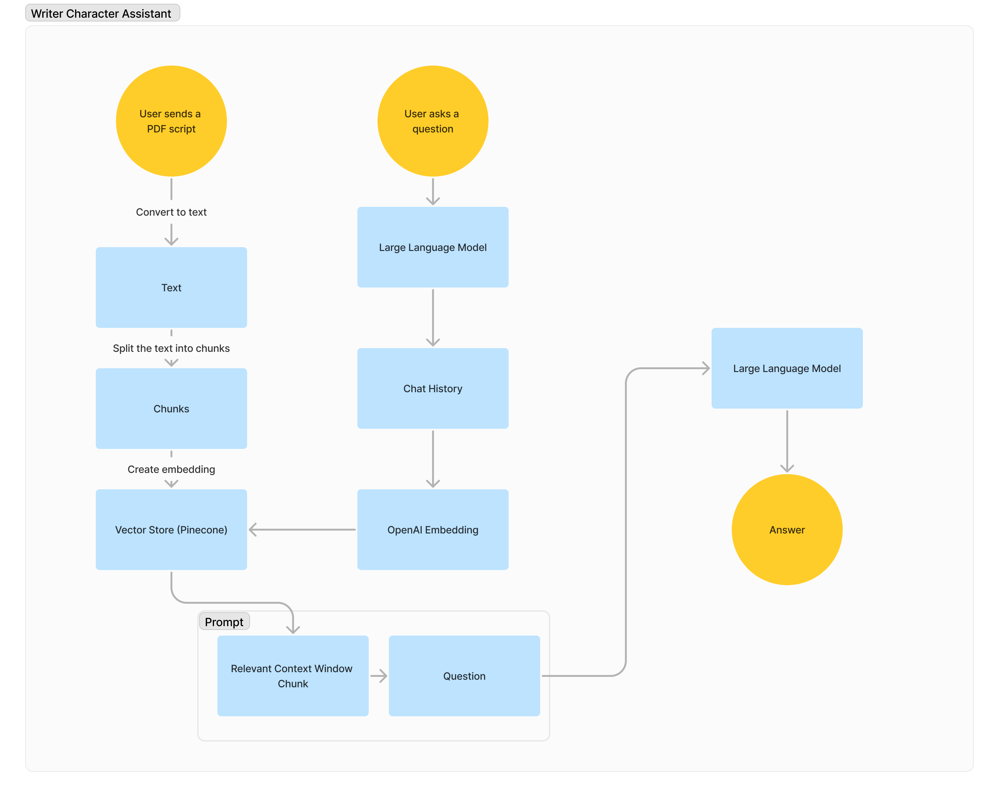

# Experiment: LLM agent that parse PDF script and take one of the roles to talk with

Tech Stack: Langchain, Pinecone, Next.js, TailwindCSS, TS, Firebase

How it works:

1. PDF Conversion: Converts PDF documents into plain text for processing.
2. Text Chunking: Splits the converted text into smaller segments to facilitate easier handling and analysis.
3. Embedding Creation: Utilizes the OpenAI Embedding API to generate semantic embeddings for each text chunk, storing these
4. embeddings in a VectorStore.
5. Query Processing: Converts new user queries into embeddings to understand the semantic intent.
6. Document Retrieval: Searches the VectorStore for text chunks with embeddings closest to the query's embedding, identifying relevant document sections.
7. Response Generation: Feeds the relevant text chunks and the user query into a large language model (e.g., GPT-3.5) to formulate a coherent response.
8. Output Delivery: Provides the user with a direct response, potentially including links and further instructions based on the information retrieved from the PDFs.

